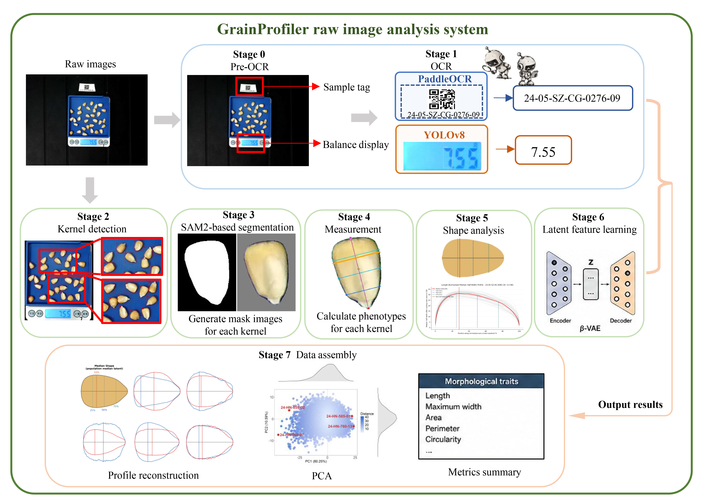

<div align="center">

# GrainProfiler

### High-throughput 2D maize-kernel phenotyping

[中文说明](README_CN.md)

</div>

> Photo input → pipeline processing → per-kernel and per-plant phenotype data.
> A Windows visual desktop application is included for viewing and checking pipeline results.

The public release covers 15,278 valid ear images and approximately 0.38M kernels across 61 germplasm accessions. This repository contains the complete pipeline source, model-training tools, desktop viewer, and deployment files.



## Choose how to use it

### Result inspection — Windows

1. Download or clone this repository.
2. Double-click `grainprofiler.exe`.
3. Click **Open Folder** and select a pipeline result directory containing `measurements.csv` (or `measurements.parquet`) and `metadata.csv`.

The desktop application does not require Python, CUDA, or conda environments.

### Process your own photos — GPU + conda

Use this route to process new kernel photos or rerun the pipeline from a selected stage.

## Runtime requirements and environments

- Linux, WSL, or another environment that can run the supplied Python scripts.
- Python 3.10 and Conda or Miniconda.
- NVIDIA GPU with CUDA 12.1; at least 12 GB VRAM is recommended for SAM2 Hiera-L.
- Raw `.jpg` images; the reference setup uses 5408 × 4056 images.

The pipeline uses three isolated environments because the YOLO, SAM2, and PaddleOCR dependencies conflict:

| Environment file | Environment | Main software | Used for |
|---|---|---|---|
| `yolo_environment.yml` | `yoloenv` | Python 3.10, PyTorch 2.4.1, Ultralytics | YOLO11/YOLO11x detection and YOLOv8n digit recognition |
| `SAM2_environment.yml` | `SAM2` | Python 3.10, PyTorch 2.5.0, SAM2.1 | SAM2 segmentation and morphology measurement |
| `paddle_environment.yml` | `paddle` | Python 3.10, PaddlePaddle GPU, PaddleOCR | Label recognition |

These `.yml` files are reference exports from the analysis server rather than
universal lock files. On another machine, adjust machine-specific Conda paths
or package variants if the exported files are not accepted directly.

## Installation

```bash
git clone https://github.com/ChangQGuo/GrainProfiler.git
cd GrainProfiler

conda env create -f yolo_environment.yml   -n yoloenv
conda env create -f SAM2_environment.yml   -n SAM2
conda env create -f paddle_environment.yml -n paddle

# Stage 3 requires the SAM2 source repository.
git clone https://github.com/facebookresearch/sam2.git
cd sam2
pip install -e .
cd ..
# Download sam2.1_hiera_large.pt into the SAM2 checkpoint directory.
```

Prepare the model weights listed in `pipeline/config.yaml`. The VAE checkpoint and the ONNX decoder used by the desktop application are included in this repository. YOLO and ResNet weights are available from the associated [Hugging Face release](https://huggingface.co/datasets/648121844Gg/GrainProfiler_v1.0), which also provides a small 500-photo dataset and its analysis results. Download the SAM2 checkpoint from the official source.

## Configure and run

It is recommended not to edit machine-specific paths directly in `pipeline/config.yaml`. Copy the local configuration template first:

```bash
cp pipeline/env.local.yaml.example pipeline/env.local.yaml
```

Set the following values in `pipeline/env.local.yaml`:

- Python paths for the `yoloenv`, `SAM2`, and `paddle` environments;
- `runtime.gpu_device`;
- the raw-image directory;
- YOLO, ResNet, and SAM2 checkpoint paths;
- the output directory.

Run from the `pipeline` directory:

```bash
conda activate SAM2
cd pipeline

# Full run: pre_ocr → ocr → detection → segmentation → measurements
#          → shapes → vae_encode → assembly
python main.py config.yaml

# Run one stage
python main.py config.yaml --stage detection

# Resume from an existing intermediate stage
python main.py config.yaml --from-stage segmentation
```

## The 8 stages

| Stage | What it does | Main output |
|---|---|---|
| 0 · `pre_ocr` | Detects label and scale-screen regions; recognizes scale digits | `yolo_label_weight_boxes.json` |
| 1 · `ocr` | Reads sample names, parses weight, and calculates tray calibration | `metadata.csv` |
| 2 · `detection` | Detects kernels and applies tray, shape, size, and overlap filters | `yolo_bounding_boxes.json` |
| 3 · `segmentation` | Uses SAM2 box prompts to create one mask per kernel | `masks_binary/`, `subimages/`, `contours/` |
| 4 · `measurements` | Predicts the directed axis and calculates morphology | `axis_results.json`, `measurements.csv` |
| 5 · `shapes` | Builds 100-point normalized width profiles | `rep_width_profiles.txt`, `median_outlines.csv` |
| 6 · `vae_encode` | Encodes plant profiles into five latent traits | `latent_traits.csv` |
| 7 · `assembly` | Merges image, kernel, plant, weight, and trait data | `final_output_*.csv` |

## Main outputs

- `final_output_individual.csv`: per-kernel data including length, width, area, perimeter, circularity, and eccentricity.
- `final_output_plant_median.csv`: plant/sample-level median morphology and weight information.
- `rep_width_profiles.txt`: one 100-point width profile per sample for PCA and VAE.
- `latent_traits.csv`: five VAE latent traits per sample for downstream GWAS phenotype input.
- `metadata.csv`: sample identity, weight, tray dimensions, and `mm_per_px` calibration.
- `axis_results.json`: per-kernel axis endpoints and measurement status.
- `subimages/`, `masks_binary/`, and `contours/`: intermediate results used by the desktop viewer.

## GrainProfiler desktop application

`grainprofiler.exe` is a Windows 10/11 result viewer. It can:

- browse samples and tray photos;
- overlay kernel contours and axis endpoints;
- inspect per-kernel traits and plant-level median profiles;
- view PCA and the five-dimensional VAE latent space;
- filter and export table data.

The desktop source is in `grainprofiler/`. To run it from source:

```bash
pip install PySide6 numpy pandas matplotlib opencv-python onnxruntime
python grainprofiler/main.py
```

## Repository layout

```text
pipeline/                 8-stage processing pipeline
grainprofiler/             desktop viewer source
resnet/                    directed-axis model and training tools
vae/                       β-VAE training and interpretation tools
downstream_analysis_scr/  PCA, correlation, and reproducibility analysis
project_figs/              workflow figure and viewer demos
*.yml                     conda environment definitions
```

## Model overview

1. YOLO11 — label and scale-screen regions
2. YOLO11x — kernel detection
3. YOLOv8n — seven-segment scale digits
4. SAM2.1 Hiera-L — instance masks
5. Custom ResNet — directed kernel axis `(cos θ, sin θ)`
6. β-VAE — 100-point profiles to five latent traits

Training and evaluation scripts are in `resnet/` and `vae/`. Scientific settings such as detection thresholds and measurement parameters are in `pipeline/config.yaml`; machine-specific paths belong in `pipeline/env.local.yaml`.

## License

See [LICENSE](LICENSE). This repository is temporarily closed-source before
publication and is currently distributed under all-rights-reserved terms. The
licensing status is planned to be revisited after publication. Please contact
Cedric Guo at `762323483@qq.com` before redistributing or using the code, data,
or model files.
