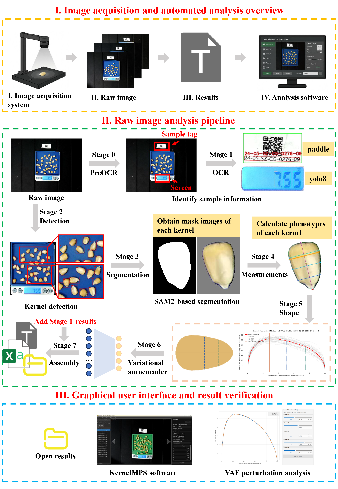
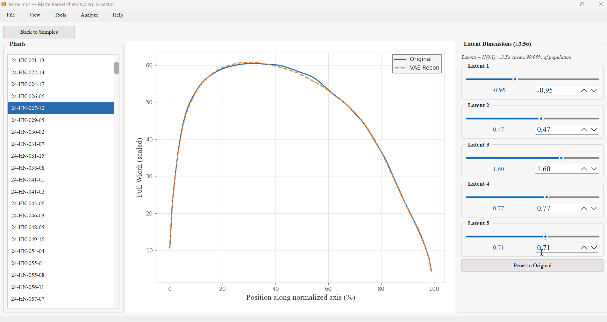

<div align="center">

**🌐 Language / 语言**

[](README.md)　[](README_EN.md)

</div>

# GrainProfiler — 玉米籽粒高通量表型识别系统

> **Maize Kernel Morphology Phenotyping System**
> 全自动玉米籽粒 2D 形态表型流水线：**原始照片 → 8 阶段自动处理 → 用于下游分析的数据**，配套一个面向用户的桌面可视化软件 GrainProfiler。
>
> 已处理 **15,287 个玉米穗样本 / 386,386 粒玉米籽粒**，覆盖 61 份玉米种质（杂交种、自交系、地方品种）。

> **🚀 结果快速检索桌面软件**
> 1. 下载本仓库的 `grainprofiler.exe`（Windows 程序）
> 2. 双击运行 —— 无需安装 Python / GPU / conda
> 3. 打开软件 → 点「打开文件夹」→ 选择流水线结果目录
>
> 详见 [§6.3](#63-使用桌面软件-grainprofiler)

---

## 目录

- [GrainProfiler — 玉米籽粒高通量表型识别系统](#grainprofiler--玉米籽粒高通量表型识别系统)
  - [目录](#目录)
  - [1. 项目简介](#1-项目简介)
  - [2. 核心特性](#2-核心特性)
  - [3. 目录结构](#3-目录结构)
  - [4. 环境要求](#4-环境要求)
  - [5. 安装](#5-安装)
  - [6. 快速开始](#6-快速开始)
    - [6.1 配置](#61-配置)
    - [6.2 运行流水线](#62-运行流水线)
    - [6.3 使用桌面软件 GrainProfiler](#63-使用桌面软件-grainprofiler)
  - [7. 流水线 8 阶段详解](#7-流水线-8-阶段详解)
    - [阶段间数据流（桥梁文件）](#阶段间数据流桥梁文件)
    - [Stage 2 检测的 4 级级联过滤](#stage-2-检测的-4-级级联过滤)
    - [Stage 4 有向轴与形态测量](#stage-4-有向轴与形态测量)
  - [8. 模型体系](#8-模型体系)
    - [关键设计决策（WHY）](#关键设计决策why)
    - [ResNet 训练细节](#resnet-训练细节)
    - [β-VAE 训练细节](#β-vae-训练细节)
  - [9. 模型权重说明](#9-模型权重说明)
  - [10. 输入输出数据格式](#10-输入输出数据格式)
    - [输入](#输入)
    - [输出（关键文件）](#输出关键文件)
  - [11. GrainProfiler 桌面软件](#11-grainprofiler-桌面软件)
  - [12. 人工标注工具](#12-人工标注工具)
  - [13. 常见问题](#13-常见问题)
  - [14. 下游分析脚本](#14-下游分析脚本)
  - [15. 版权与许可](#15-版权与许可)

---

## 1. 项目简介

GrainProfiler 是一个「**照片到表型**」的玉米籽粒形态高通量分析系统。输入一张原始籽粒照片（5408×4056），系统自动完成样本信息识别、重量读数、籽粒检测、实例分割、籽粒方向预测、形态测量、连续形状表征与潜在性状编码，最终输出**单籽粒级**与**样本级**的性状表，可直接对接下游 GWAS 分析。

**研究动机**：传统籽粒表型依赖人工测量或半自动图像处理，通量低、只能得到「预先定义」的低维离散指标（粒长、粒宽、面积等），无法表达轮廓饱满度、最大宽位置、冠部扩张、基部收缩等连续结构变异。本项目将方法学从「手工定义指标」升级为「数据驱动的表征学习」，建立从图像到高维形状表征再到遗传分析的闭环。

**技术栈**：YOLO11 / YOLOv8n（检测）、PaddleOCR（标签文本）、SAM2.1 Hiera-L（实例分割）、自建 ResNet（有向轴回归）、β-VAE（无监督潜在性状）、PySide6（桌面 GUI）、PyInstaller（打包）、Python 3.10 / PyTorch 2.4+。

**全流程总览**：



---

## 2. 核心特性

1. **端到端自动工作流**：YOLO11（标签+秤屏+籽粒）+ SAM2 + PaddleOCR + YOLOv8n（数码管），原始图像直出结构化数据库。
2. **籽粒方向预测**：搭建 ResNet 回归模型预测「冠部 → 花梗」方向，有向轴（(cosθ, sinθ) 向量回归），消除籽粒随机摆放的方向噪声。
3. **100 维连续全宽轮廓**：把 2D 轮廓沿有向主轴等距采样成 100 维标准宽度分布，从离散标量走向连续形状描述。
4. **潜形态发现**：PCA（前两主成分解释 **90.84%** 方差）+ β-VAE（5 维非正交潜特征，捕获饱满度、锥度、宽度再分配等非线性特征）。
5. **配套桌面软件 GrainProfiler**：交互式结果检查、异常校准、潜空间探索，三视图双向联动。

**关键量化指标**

| 环节 | 指标 |
|------|------|
| YOLO11 标签/秤屏检测 | P=0.997, R=1.000, mAP50=0.995, mAP50-95=0.939 |
| YOLO11x 籽粒检测 | 测试集 821 TP / 3 FP，计数与人工 R²≈1.0 |
| 端到端标签识别 | 96.80% |
| 端到端秤屏读数 | 96.00% |
| 有向轴预测 | MAE 3.38°, P50=2.35°, 80%<5°, 95.4%<10° |
| PCA | PC1=80.25%, PC2=10.59%, 累计 90.84% |
| β-VAE | 100 维 → 5 维潜变量，β=0.001 |

---

## 3. 目录结构

```
seed_project_v1.0/
├── README.md                     # 中文说明（本文件）
├── README_EN.md                  # 英文说明
├── LICENSE                       # 专有许可（暂时闭源 · 保留所有权利）
├── .gitignore                    
├── .gitattributes                
├── grainprofiler.exe                 # Windows 桌面软件（Git LFS 存储，双击即用）
├── grainprofiler.spec                # PyInstaller 打包脚本（生成 grainprofiler.exe）
├── yolo_environment.yml          # conda 环境：YOLO 检测 / 数码管
├── SAM2_environment.yml          # conda 环境：SAM2 分割 / 测量
├── paddle_environment.yml        # conda 环境：PaddleOCR 标签文本
│
├── pipeline/                     # 8 阶段workflow
│   ├── main.py                   # 编排器（pre_ocr→ocr→detection→segmentation→measurements→shapes→vae_encode→assembly）
│   ├── config.yaml               # 全局配置（模型路径 / 阈值 / 标定 / 输出）
│   ├── env.local.yaml.example    # 本机覆盖配置模板（复制为 env.local.yaml）
│   ├── README.md                 # 流水线说明
│   ├── ocr/                      # Stage 0-1：标签 / 秤屏检测 + OCR
│   │   ├── yolo_label_detect.py  # YOLO11 标签/秤屏 ROI + YOLOv8n 数码管数字
│   │   ├── metadata_extraction.py# PaddleOCR 标签文本 + 重量解析 + 标定
│   │   ├── qc_render.py          # OCR QC 渲染（视图层）
│   │   └── text_parse.py         # 文本归一化与候选解析
│   ├── detection/                # Stage 2：籽粒检测
│   │   └── yolo_detect.py        # YOLO11x 检测 + 4 级级联过滤
│   ├── segmentation/             # Stage 3：实例分割
│   │   └── sam_segment.py        # SAM2 掩码 + RGB 子图（中性灰底）
│   ├── measurements/             # Stage 4：有向轴 + 形态测量
│   │   ├── kernel_metrics.py     # 门面：编排 + ResNet 轴预测 + 记录组装 + run()
│   │   ├── geometry.py           # 几何（重采样 / 交点 / 宽度 / 面积 / 圆形度）
│   │   ├── axis.py               # 轴候选生成 / 多线索打分 / 择优 / 微调
│   │   └── qc.py                 # 测量 QC 渲染
│   ├── processing/               # Stage 5：代表性形状
│   │   ├── representative_shape.py # 植株级中位数轮廓 + 100 维宽度 profile
│   │   └── contour_extraction.py   # 轮廓提取（最大连通域）
│   ├── vae/                      # Stage 6：VAE 潜性状编码
│   │   ├── vae_encode.py         # 100 维轮廓 → 5 维潜变量
│   │   ├── model.py              # VAE Encoder（编码阶段）
│   │   └── vae_checkpoint.pt     # 已训练 VAE 权重
│   ├── output/                   # Stage 7：最终 CSV 组装
│   │   └── assembler.py          # final_output_individual / plant_median
│   └── utils/                    # 共享工具
│   │   ├── config.py             # 共享配置加载（env.local.yaml 覆盖）
│   │   ├── kernel_id.py          # 籽粒身份信息解析
│   │   ├── bbox.py               # YOLO bbox JSON 解析
│   │   ├── calibration.py        # 托盘标定（mm/px）
│   │   ├── device.py             # GPU 设备选择
│   │   └── visualization.py      # 绘图工具
│
├── grainprofiler/                    # 桌面 GUI 源码（Windows 构建源）
│   ├── main.py                   # 程序入口
│   ├── __main__.py               # python -m grainprofiler 入口
│   ├── __init__.py               # 包标记
│   ├── app/                      # 主窗口 + 数据加载
│   │   ├── __init__.py           # 包标记
│   │   ├── main_window.py        # QMainWindow：三栏工作区 + 分析面板
│   │   ├── data_loader.py        # 结果加载（Parquet 优先 + 轮廓懒加载）
│   │   ├── models.py             # 数据模型
│   │   └── settings.py           # 设置
│   ├── widgets/                  # 面板组件
│   │   ├── __init__.py           # 包标记
│   │   ├── welcome_widget.py     # 欢迎页
│   │   ├── nav_panel.py          # 样本列表 / 筛选 / 主题
│   │   ├── sample_view.py        # QGraphicsView 交互式托盘图 + 轮廓叠加
│   │   ├── median_chart.py       # 半宽轮廓图（双向联动）
│   │   ├── sample_info_panel.py  # 元数据 + 测量表
│   │   ├── kernel_detail_dialog.py # 单籽粒详情
│   │   ├── pca_window.py         # PCA 散点
│   │   ├── vae_latent_window.py  # VAE 潜变量实时解码（ONNX）
│   │   ├── sample_analysis_window.py # 性状分布
│   │   └── similarity_boxplot.py # 相似性箱线图
│   ├── graphics/                 # QGraphics 图元
│   │   ├── __init__.py           # 包标记
│   │   ├── kernel_contour_item.py # 籽粒轮廓图元
│   │   ├── axis_line_item.py     # 轴线图元
│   │   └── axis_endpoint_item.py # 轴端点图元
│   ├── models/                   # Qt 表格模型
│   │   ├── __init__.py           # 包标记
│   │   ├── pandas_model.py       # pandas 表格模型
│   │   └── sort_filter_proxy.py  # 排序 / 筛选代理
│   ├── utils/                    # 工具
│   │   ├── __init__.py           # 包标记
│   │   ├── coordinate_transform.py # 坐标变换
│   │   ├── export.py             # CSV 导出
│   │   ├── image_conversion.py   # 图像转换
│   │   └── photo_finder.py       # 照片查找
│   └── resources/                # 光标 / 图标资源
│       ├── cursors.py            # 光标定义
│       └── gen*.py / generate_assets.py # 资源生成脚本（一次性）
│
├── onnx_models/                  # VAE Decoder ONNX（GUI 潜变量窗口用）
│   ├── profile_vae_latent5.onnx        # 解码器图结构
│   ├── profile_vae_latent5.onnx.data   # 解码器权重（外部数据）
│   ├── vae_col_mean.npy          # 训练集逐位均值（反归一化）
│   └── vae_col_std.npy           # 训练集逐位标准差（反归一化）
├── grainprofiler_minifig/            # GUI 图标资源
│   ├── 图标.png                  # 应用图标
│   └── 玉米.png                  # 玉米图标
│
├── resnet/                       # 有向轴回归模型（自建 ~2.2M）
│   ├── model.py                  # ResNetAngleRegressor + BasicBlock（3/4 通道）
│   ├── preprocess.py             # square/crop/mask/none 预处理
│   ├── train_resnet_angle.py     # 训练（方向余弦损失）
│   ├── predict_resnet_angle.py   # 推理
│   ├── test_resnet_angle.py      # 评估
│   ├── plot_results.py          
│   ├── config.yaml               # 训练配置
│   ├── run_train.sh              # 训练启动脚本
│   ├── run_test.sh               # 测试启动脚本
│   └── README.md                 # 说明
│
├── vae/                          # β-VAE 无监督形状性状
│   ├── model.py                  # 1D-CNN Encoder/Decoder（100→50→25→5）
│   ├── dataset.py                # 数据加载 + 逐位 Z-score
│   ├── train_vae.py              # 训练（MSE + β·KL）
│   ├── export_onnx.py            # Decoder → ONNX
│   ├── interpret_latents.py      # 潜在维度扰动分析
│   ├── latent_shape_explorer.py  # 极值解码可视化
│   ├── latent_perturbation_grid.py # 扰动网格
│   ├── reconstruct_samples.py    # 代表性样本重建
│   ├── reconstruct_test_rmse.py  # 测试集逐样本 RMSE 箱线图 + 表格
│   ├── plot_rmse_iou_boxplot.py  # RMSE/IoU 箱线图
│   ├── latent_load_curves.ipynb  # 载荷曲线分析
│   ├── latent_load_curves.png    # 载荷曲线图
│   ├── config.yaml               # 训练配置
│   ├── run_*.sh                  # 各启动脚本
│   ├── __init__.py               # 包标记
│   └── README.md                 # 说明
│
├── label_mini_program/           # 人工标注工具
│   ├── angle_labeler.py          # OpenCV 交互式角度标注
│   ├── centroid_overlay.py       # 质心叠加
│   └── label_program_guide.ipynb # 标注指南
│
├── downstream_analysis_scr/      # 下游分析脚本
│   ├── 1.PCA_analyze.R           # PCA 降维
│   ├── 2.correlation heatmap.R   # 相关性热图
│   └── 3.seed_size_r2.ipynb      # 籽粒尺寸可重复性评估
│
└── project_figs/                 # 图示与演示
    ├── workflow_figure.png       # 全流程总览图
    ├── Main Panel Interaction.gif # 主面板交互录屏
    └── VAE_latent_explorer.gif   # VAE 潜变量探索录屏
```

---

## 4. 环境要求

流水线使用 **3 个互相隔离的 conda 环境**，因为 YOLO（ultralytics）、SAM2、PaddleOCR 三方依赖冲突、无法共存：

| 环境文件 | Python | 关键依赖 | 用途 | 硬件 |
|----------|--------|----------|------|------|
| `yolo_environment.yml` | 3.10 | PyTorch 2.4.1, ultralytics 8.3.14 | YOLO11/11x 检测、YOLOv8n 数码管 | CUDA 12.1 |
| `SAM2_environment.yml` | 3.10 | PyTorch 2.5.0, sam-2 1.0, ultralytics 8.3.31 | SAM2 分割、形态测量（含 numpy/shapely/pandas/cv2） | CUDA 12.1 |
| `paddle_environment.yml` | 3.10.20 | paddlepaddle-gpu 2.5.2, paddleocr 2.7.0.3 | PaddleOCR 标签文本 | CUDA 12.1 |

**硬件**：NVIDIA GPU（CUDA 12.1，≥ 12GB 显存建议，SAM2 Hiera-L 较大）。

---

## 5. 安装

```bash
# 1) 克隆 / 解压本仓库
cd seed_project_v1.0

# 2) 创建三个 conda 环境（按顺序，可并行）
conda env create -f yolo_environment.yml   -n yoloenv
conda env create -f SAM2_environment.yml   -n SAM2
conda env create -f paddle_environment.yml -n paddle

# 3) 安装 SAM2 仓库（分割阶段依赖其源码）
#    SAM2 需从官方仓库获取，并下载 sam2.1_hiera_large.pt checkpoint
git clone https://github.com/facebookresearch/sam2.git
cd sam2 && pip install -e . && cd ..
# 下载 checkpoint 到 sam2/checkpoints/sam2.1_hiera_large.pt
```

---

## 6. 快速开始

### 6.1 配置

编辑 `pipeline/config.yaml`，或（推荐）复制模板并只覆盖本机路径：

```bash
cp pipeline/env.local.yaml.example pipeline/env.local.yaml
# 编辑 env.local.yaml，填入本机的：
#   environments.*（三个环境 python 路径）
#   runtime.gpu_device
#   input.image_dir（输入托盘照片目录）
#   models.*（各模型权重路径）
#   output.base_dir（结果输出目录）
```

`env.local.yaml` 会递归覆盖 `config.yaml` 的同名键，科学配置（检测阈值、测量参数、标定等）保留在 `config.yaml` 中。

### 6.2 运行流水线

```bash
# 全流程（依次跑 8 个阶段，跨 3 个环境）
conda activate SAM2
cd pipeline
python main.py config.yaml

# 只跑某阶段
python main.py config.yaml --stage detection

# 从某阶段断点续跑
python main.py config.yaml --from-stage segmentation
```

### 6.3 使用桌面软件 GrainProfiler

**快速结果检查软件：**

1. 在本仓库根目录找到 `grainprofiler.exe`（Windows 程序，约 148 MB）。
2. 双击 `grainprofiler.exe` 直接运行 —— **不需要 Python、GPU 或 conda**。
3. 打开软件后，点「打开文件夹」，选择流水线输出的结果目录（即包含 `measurements.csv` 的文件夹）。
4. 即可浏览样本、查看籽粒轮廓与测量值、筛选、导出 CSV。

使用演示录屏见 [§11](#11-grainprofiler-桌面软件)（主面板交互、VAE 潜变量探索）。

> 若 Windows 弹出「Windows 已保护你的电脑」，点「更多信息」→「仍要运行」。

**开发者（可选）：**

```bash
# 从源码运行（需 PySide6）
pip install PySide6
python grainprofiler/main.py

# 重新打包 exe
pip install pyinstaller
pyinstaller grainprofiler.spec   # 产物在 dist/grainprofiler.exe
```

---

## 7. 流水线 8 阶段详解

```
原始托盘照片 (.jpg, 5408×4056)
    │
    ▼
[Stage 0: pre_ocr]    YOLO11 → 标签纸 + 秤屏 ROI；YOLOv8n → 数码管数字
[Stage 1: ocr]        PaddleOCR → 品种名(plant_name) + 重量(weight_g) + 托盘标定(mm/px)
[Stage 2: detection]  YOLO11x → 籽粒边界框 + 4 级级联过滤
[Stage 3: segmentation] SAM2.1 Hiera-L → 籽粒二值掩码 + RGB 子图（中性灰底）
[Stage 4: measurements] ResNet → 有向主轴 + 10+ 形态指标 + 100 维宽度轮廓
[Stage 5: shapes]     样本级中位数 100 维宽度轮廓 + 代表性形状图
[Stage 6: vae_encode]  β-VAE 编码 → 5 维潜在性状 (latent_traits.csv)
[Stage 7: assembly]   合并输出 final_output_individual / plant_median.csv
    │
    ▼
下游: PCA / β-VAE  / 相关性热图 → GWAS
```

### 阶段间数据流（桥梁文件）

| 阶段 | 输出文件 | 内容 | 供后续 |
|------|----------|------|--------|
| 0→1 | `yolo_label_weight_boxes.json` | 标签/秤屏框 + 数码管数字 + weight_g | OCR |
| 1→4,5,7 | `metadata.csv` | plant_name + weight_g + mm/px 标定 | 测量/形状/组装 |
| 2→3,4 | `yolo_bounding_boxes.json` | 籽粒框（含过滤原因、accepted 列表） | 分割/测量 |
| 3→4,5 | `subimages/` + `masks_binary/` | 单籽粒 RGB 子图（灰底）+ 二值掩码 | 测量/形状 |
| 3→4,5 | `contours/` + `kernel_contours.json` | 轮廓点（按图拆分 + 单文件兼容） | 测量/形状 |
| 4→5 | `axis_results.json` | 每籽粒 bottom/top 端点 + 轴长 | 形状 |
| 4→7 | `measurements.csv / .parquet` | 单籽粒形态表 | 组装 |
| 5→7 | `median_outlines.csv` | 植株中位数表 | 组装 |
| 5→6 | `rep_width_profiles.txt` | 每植株 100 维宽度轮廓 | VAE/PCA |
| 6→GWAS | `latent_traits.csv` | plant_id + latent_1..5 | GWAS |

### Stage 2 检测的 4 级级联过滤

1. **托盘约束**：框中心须在托盘内、与托盘重叠 > 55%，边缘框裁剪进托盘 ROI。
2. **长宽比**：AR < 4.0（过滤细长伪影）。
3. **统计尺寸离群**：相对盘内中位数的 0.35–3.0×（面积）、0.45–2.2×（边长）。
4. **嵌套重叠抑制**：两框重叠 > 86% 且面积比 > 1.15 → 保留更接近中位数的框。
   （另有 multi-center 过滤：大框内包含多个其他框中心则删除。）

### Stage 4 有向轴与形态测量

- 掩码清理 → 质心（`cv2.moments`）→ 轮廓等弧重采样（360 点）。
- **ResNet 预测有向单位向量 (cosθ, sinθ)** → 过质心直线与轮廓求交点 → bottom/top 端点。
- **多线索打分确定冠部/花梗**：端点锐度（多尺度窗口）、尖端锥度、宽度单调性、面积对称、宽度对称、LAB 颜色对称，加权融合（面积 0.25 / 宽度 0.30 / 颜色 0.25 / 长度 0.10 / 端点 0.10）。
- 测量：主轴长、最大宽、W25/W50/W75、面积（Shoelace）、周长、圆形度（4πA/P²）、长宽比、偏心率。
- 宽度轮廓：沿主轴 100 个等距位置画垂线，Shapely 求交线长度。
- 圆粒过滤：circularity > 0.90 → 标记 Round（跳过长度/宽度）。
- 物理标定：HSV 检测 100mm 蓝色/绿色托盘 → mm/px（约 0.052–0.054）。

---

## 8. 模型体系

| # | 模型 | 规模 | 输入 | 输出 | 环境 |
|---|------|------|------|------|------|
| 1 | YOLO11 | 56.8M | 托盘照片 | label + weight_screen 框 | yoloenv |
| 2 | YOLO11x | 56.8M | 托盘照片 | 籽粒边界框 (mAP50=0.995) | yoloenv |
| 3 | YOLOv8n | - | 秤屏裁剪 1280×512 | 0-9 数字序列 | yoloenv |
| 4 | SAM2.1 Hiera-L | - | 全图 + YOLO 框提示 | 二值掩码 | sam2 |
| 5 | ResNet（自建） | ~2.2M | RGB 籽粒 256×256 | (cosθ, sinθ) 有向轴 | base |
| 6 | β-VAE | ~19K | 100 维宽度轮廓 | 5 维潜在向量 | base |

### 关键设计决策（WHY）

1. **数码管识别用 YOLOv8n 而非 OpenCV 分割**：七段数码管在光照/角度变化下段间间隙不稳定，传统阈值分割无法泛化；端到端 10 类小目标检测对光照/尺度天然鲁棒。
2. **SAM2 子图背景用中性灰 (128,128,128)**：黑籽粒在黑背景、白籽粒在白背景都会消失；中度灰对全色域籽粒是最佳折中，且 ImageNet 归一化后落在约 (0,0,0) 的「无信息」中心。
3. **籽粒方向用 ResNet 回归而非 PCA/图像矩**：矩/PCA 只能给无向轴，无法区分冠部/花梗；向量回归避免角度周期性跳变，正确处理 W25/W50/W75 的方向依赖。
4. **β-VAE 而非纯 PCA**：PCA 是线性正交变换，β-VAE 学习非线性流形；β=0.001 弱正则，5 维潜变量比 100 维更适合 GWAS（减少多重检验负担）。

### ResNet 训练细节

- 预处理：`square`（短边灰填充 → resize 256×256）。
- 损失：`1 - cosine_similarity(pred, target)`（+ λ·|||pred||−1|²，norm_loss_weight=0）。
- 优化器 AdamW (lr=1e-4, wd=1e-4)，CosineAnnealingLR，早停 patience=30，batch 32，seed 42，80/10/10 划分。
- 增强：亮度/对比度抖动 ±4%，高斯噪声 30% 概率 σ=8px。

### β-VAE 训练细节

- 架构：1D-CNN Encoder(100→50→25→5) + Decoder(5→25→50→100)。
- 损失：MSE(recon, x) + β·KL(𝒩(μ,σ²)‖𝒩(0,I))，β=0.001。
- 优化器 AdamW (lr=5e-4)，ReduceLROnPlateau，早停 patience=50。
- 输入标准化：逐位 Z-score；输出 `latent_traits.csv` 直接对接 GAPIT/GEMMA/FarmCPU。

---

## 9. 模型权重说明

| 权重 | 路径（config.yaml 中） | 是否随仓库分发 | 说明 |
|------|------------------------|----------------|------|
| YOLO11 标签/秤屏 | `models.label_weight_yolo` | ❌ | 需自行训练或获取 |
| YOLO11x 籽粒 | `models.yolo_detection` | ❌ | 需自行训练或获取 |
| YOLOv8n 数码管 | `models.weight_digit_yolo` | ❌ | 需自行训练或获取 |
| SAM2.1 Hiera-L | `models.sam2_checkpoint` | ❌ | 官方 [facebookresearch/sam2](https://github.com/facebookresearch/sam2) 下载 |
| ResNet 有向轴 | `models.resnet_axis` | ❌ | 用 `resnet/train_resnet_angle.py` 训练 |
| β-VAE | `pipeline/vae/vae_checkpoint.pt` | ✅ 已含 | 极小（~19K 参数） |
| VAE Decoder ONNX | `onnx_models/` | ✅ 已含 | GUI 潜变量窗口实时解码 |

> 训练脚本均在 `resnet/` 与 `vae/` 目录；YOLO 训练遵循 ultralytics 标准流程。各权重路径在 `config.yaml` 中配置，建议用 `env.local.yaml` 覆盖。

---

## 10. 输入输出数据格式

### 输入

- 托盘照片（`.jpg`，5408×4056），每张对应一个果穗样本。
- 拍照平台：GP-2000 高拍仪，固定高度 310mm，统一曝光/ISO/白平衡；3D 打印 100mm 蓝色/绿色称量托盘作为物理标定参照（约 19 px/mm）；磨砂黑色橡胶垫背景；籽粒随机摆放；标签（含样本 ID/二维码）置于视野内。

### 输出（关键文件）

| 文件 | 粒度 | 关键字段 |
|------|------|----------|
| `final_output_individual.csv` | 单籽粒 | kernel_name, plant_name, weight_g, length_mm, max_width_mm, width_25/50/75pct_mm, area_mm2, perimeter_mm, circularity, length_width_ratio, eccentricity |
| `final_output_plant_median.csv` | 植株 | plant_name, weight_g, n_kernels, median_* 系列, weight_per_kernel_g |
| `measurements.csv / .parquet` | 单籽粒 | 全量形态 + 诊断字段 |
| `rep_width_profiles.txt` | 植株 | plant_name + 100 维宽度轮廓（PCA/VAE 输入） |
| `latent_traits.csv` | 植株 | plant_id + latent_1..5（GWAS 输入） |
| `metadata.csv` | 图像 | image_name, plant_name, weight_g, mm_per_px, 托盘信息, OCR 原始文本 |
| `axis_results.json` | 单籽粒 | bottom/top 端点、轴长、形状标签 |
| `subimages/` + `masks_binary/` | 单籽粒 | RGB 子图（灰底）+ 二值掩码 |
| `contours/` | 图像 | 每籽粒轮廓点（GUI 懒加载） |

---

## 11. GrainProfiler 桌面软件

GrainProfiler 是 **纯只读数据浏览器**（无需 GPU/conda/pipeline，双击 exe 即用），**仅支持 Windows 10/11**。

**三栏工作区**：左（样本列表/筛选）→ 中（托盘图 + 轮廓叠加 + 半宽轮廓图）→ 右（元数据 + 测量表）。

**核心功能**：

| 面板 | 功能 |
|------|------|
| SampleView | 交互式托盘照片、籽粒轮廓叠加、悬停高亮、点击选中、滚轮缩放、标尺工具 |
| SampleInfoPanel | 元数据（可编辑带锁）、植株级统计、测量表（排序/筛选/导出 CSV） |
| KernelDetailDialog | 单籽粒子图 + 轮廓 + 轴端点 + 全量指标 |
| MedianChart | 半宽轮廓图：灰线=单粒、蓝线=中位数、悬停红线高亮 |
| PCAPanel | numpy PCA 散点 + PC1-5 得分表 + 代表形状预览 |
| VAELatentWindow | ONNX 实时解码：5 维潜变量滑块 ↔ 重建曲线 |
| SampleAnalysisWindow | 性状分布：排序散点 + 回归线 + 多性状分窗 |

**软件演示录屏**：

- 主面板交互：
- VAE 潜变量探索：

**交叉双向联动**：Overlay 籽粒轮廓 ↔ Median 宽度线 ↔ 测量表行 三者完全同步（悬停/点击互相高亮）。

**数据加载优化**：Parquet 优先（1-2s vs CSV 10-15s）、轮廓 LRU 懒加载（最近 5 图缓存）。

**打包**：`pyinstaller grainprofiler.spec`（已排除 torch/ultralytics/paddle/sklearn 以瘦身）。

---

## 12. 人工标注工具

`label_mini_program/angle_labeler.py` 是 OpenCV 交互式角度标注器，用于标注籽粒的「冠部 → 花梗」有向角度：

```bash
python label_mini_program/angle_labeler.py
# 质心锚点 + 可旋转箭头，键盘微调，输出 cosθ/sinθ 与辅助 cos2θ/sin2θ
```

训练集共标注 ~8,300 粒籽粒（剔除歧义样本后 7,646 粒），用于训练有向轴 ResNet。

---

## 13. 常见问题

**Q1：报 `ModuleNotFoundError: No module named 'utils'`**
每个阶段脚本通过 `sys.path.insert` 把 `pipeline/` 加入搜索路径；若报此错，确认脚本顶部有 `sys.path.insert(0, os.path.dirname(os.path.dirname(os.path.abspath(__file__))))`，且位于本地 import 之前。

**Q2：换机器后路径不对**
用 `pipeline/env.local.yaml` 覆盖机器相关路径（environments / input / models / output），不要改 `config.yaml` 里的科学配置。

**Q3：mm 列出现空值/NaN**
通常是某张图标定失败。确认 `calibration.fixed_mm_per_px` 兜底值，或检查托盘颜色是否在 `calibration.tray_color_ranges` 内。v1.0 已在 `representative_shape.py` 中加入「植株主导 mm_per_px 补齐」逻辑。

**Q4：黑色籽粒分割/测量异常**
SAM2 子图背景已用中性灰 (128,128,128)，黑色籽粒不会消失；如仍有问题，检查 `segmentation.padding` 与掩码清理参数。

**Q5：GUI 打不开结果**
确认输出目录含 `measurements.csv`（或 `.parquet`）与 `metadata.csv`；轮廓 overlay 需 `contours/` 目录或 `kernel_contours.json`。

---

## 14. 下游分析脚本

`downstream_analysis_scr/` 目录提供 3 个本项目实际使用的下游分析脚本，承接流水线输出的形状/形态数据，完成降维、相关性可视化与籽粒尺寸可重复性评估。

| 脚本 | 语言 | 输入 | 输出 | 用途 |
|------|------|------|------|------|
| `1.PCA_analyze.R` | R（ggplot2 / patchwork / ggrepel / dplyr） | `rep_width_profiles.txt`（植株 100 维宽度轮廓） | PCA 2D 散点图、方差解释表、PC1–5 得分、loading 曲线 | 100 维轮廓主成分降维与可视化 |
| `2.correlation heatmap.R` | R（GGally / hexbin / ggplot2） | 合并表：`sample_id` + PC1–5 + 6 个形态性状 | 相关热图 PNG + 相关矩阵 CSV | PC 与形态性状的发表级相关矩阵（hexbin + 显著性星号） |
| `3.seed_size_r2.ipynb` | Python（pandas / sklearn / seaborn） | `final_output_individual.csv` | R²/RMSE 汇总 + 逐性状散点图 | 中心位置 vs 偏心位置籽粒尺寸的可重复性评估 |

**脚本说明**：

1. **`1.PCA_analyze.R`**：对每株 100 维宽度轮廓做 PCA（`prcomp`，center + scale），计算各主成分方差解释率，输出 PC1–5 得分与 loading；绘制带边缘密度图的 2D 散点图（patchwork 拼图），自动标注四个象限离原点最远的极端样本，并画出 PC1/PC2 loading 沿籽粒相对位置（0–1）的变化曲线。
2. **`2.correlation heatmap.R`**：将 PCA 得分与形态性状合并，用 `ggpairs` 绘制发表级相关矩阵——右上角 hexbin + 线性回归、左下角 Pearson r + 显著性星号（`***`/`**`/`*`）、对角线密度分布；600 dpi 输出并导出相关系数矩阵 CSV。
3. **`3.seed_size_r2.ipynb`**：从 `final_output_individual.csv` 解析 `kernel_name` 得到 `test_id` 与重复号 `rep`，以 rep=1（托盘中心位置）为真值、rep 2/3（偏心位置）为预测值，对 6 个性状（粒长、最大宽、面积、周长、偏心率、圆形度）计算 R² 与 RMSE，并绘制带 y=x 参考线的散点图（示例：粒长 R²≈0.97、周长 R²≈0.98、圆形度 R²≈0.83）。

> **注意**：
> 1. 脚本内保留了作者本机的绝对路径（`C:/Users/...`），使用前请替换为你自己的输入/输出路径。
> 2. `2.correlation heatmap.R` 的输入**不是** `1.PCA_analyze.R` 的直接输出：它需要一个额外合并步骤，把 PCA 得分（PC1–5）与植株级形态性状（length / max width / area / perimeter / circularity / aspect ratio，例如来自 `final_output_plant_median.csv`）合并成一张含 `sample_id` + 11 列数值的表。

---

## 15. 版权与许可

**Copyright © 2026 ChangQGuo. 保留所有权利（All Rights Reserved）。**

本项目为**暂时闭源、未发表**：

- 未经作者书面授权，**禁止**复制、修改、再分发、商用或用于任何其他用途；
- 相关论文尚未发表，任何代码、数据、模型与结果**不得**公开或泄露；
- 如需使用或合作，请联系作者（ChangQGuo，邮箱：guocq03@outlook.com）。


---


