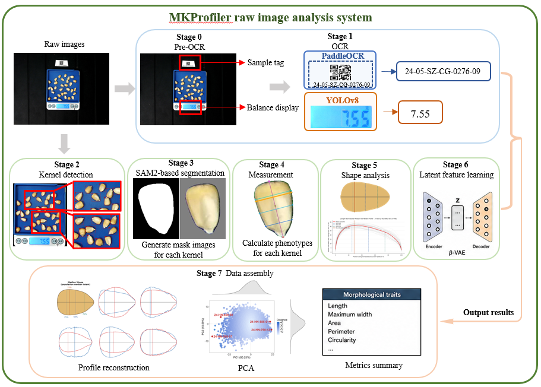

<div align="center">

# **MKProfiler**（Maize-Kernel Profiler）

### 玉米籽粒高通量二维形态表型系统

[English README（GitHub 默认入口）](README.md)

</div>

> 照片输入 → pipeline处理 → 单粒和植株级表型数据输出。
> Windows 可视化桌面软件，用于查看和检查pipeline结果。

本项目公开处理结果包含 15,278 个有效耳穗图像，涉及约 0.38M 粒籽粒（约 38 万粒），覆盖 61 份玉米种质。本仓库包含完整 pipeline 源码、模型训练工具、桌面查看器和部署文件。



## 先选择使用方式

### 结果检查：Windows

1. 下载或克隆本仓库。
2. 双击 `grainprofiler.exe` 启动 MKProfiler。
3. 点击 **Open Folder**，选择包含 `measurements.csv`（或 `measurements.parquet`）和 `metadata.csv` 的pipeline结果目录。

桌面软件不需要 Python、CUDA、conda 环境。

### 处理属于你的照片：GPU + conda

使用此方式处理新的kernel照片，或从指定阶段重新运行pipeline。

## 运行要求和环境

- Linux、WSL 或能够运行项目 Python 脚本的环境。
- Python 3.10，以及 Conda 或 Miniconda。
- NVIDIA GPU，CUDA 12.1；SAM2 Hiera-L 建议显存不低于 12 GB。
- `.jpg` 原始照片；本项目参考尺寸为 5408 × 4056。

由于 YOLO、SAM2 和 PaddleOCR 的依赖存在冲突，pipeline使用三个相互隔离的环境：

| 环境文件 | 环境 | 主要软件 | 用途 |
|---|---|---|---|
| `yolo_environment.yml` | `yoloenv` | Python 3.10、PyTorch 2.4.1、Ultralytics | YOLO11/YOLO11x 检测和 YOLOv8n 数码管识别 |
| `SAM2_environment.yml` | `SAM2` | Python 3.10、PyTorch 2.5.0、SAM2.1 | SAM2 分割和形态测量 |
| `paddle_environment.yml` | `paddle` | Python 3.10、PaddlePaddle GPU、PaddleOCR | 标签识别 |

这些 `.yml` 文件是分析服务器导出的参考环境，而不是适用于所有机器的
通用锁定文件。在其他机器上使用时，如 Conda 报告本机路径或软件包变体
不适用，请根据本机情况调整。

## 安装

```bash
git clone https://github.com/ChangQGuo/MKProfiler.git
cd MKProfiler

conda env create -f yolo_environment.yml   -n yoloenv
conda env create -f SAM2_environment.yml   -n SAM2
conda env create -f paddle_environment.yml -n paddle

# Stage 3 需要 SAM2 源码
git clone https://github.com/facebookresearch/sam2.git
cd sam2
pip install -e .
cd ..
# 将 sam2.1_hiera_large.pt 下载到 SAM2 checkpoint 目录
```

请准备 `pipeline/config.yaml` 中列出的模型权重。仓库已包含 VAE checkpoint 和桌面软件使用的 ONNX decoder；YOLO、ResNet 权重位于本研究附属的 [Hugging Face 发布页](https://huggingface.co/datasets/648121844Gg/MKProfiler_v1.0)。该页面还提供一个包含 500 张照片及其分析结果的小型数据集，SAM2 权重需自行至官网下载。

## 配置和运行

建议不要直接修改 `pipeline/config.yaml` 中的本机路径。先复制本机配置模板：

```bash
cp pipeline/env.local.yaml.example pipeline/env.local.yaml
```

在 `pipeline/env.local.yaml` 中填写：

- `yoloenv`、`SAM2`、`paddle` 三个环境的 Python 路径；
- `runtime.gpu_device`；
- 输入照片目录；
- YOLO、ResNet、SAM2 权重路径；
- 输出目录。

从 `pipeline` 目录运行：

```bash
conda activate SAM2
cd pipeline

# 全流程：pre_ocr → ocr → detection → segmentation → measurements
#       → shapes → vae_encode → assembly
python main.py config.yaml

# 只运行一个阶段
python main.py config.yaml --stage detection

# 使用已有中间结果，从指定阶段继续
python main.py config.yaml --from-stage segmentation
```

## 8 个阶段

| 阶段 | 作用 | 主要输出 |
|---|---|---|
| 0 · `pre_ocr` | 检测标签和秤屏区域，识别秤屏数字 | `yolo_label_weight_boxes.json` |
| 1 · `ocr` | 读取样本名、解析重量、计算托盘标定 | `metadata.csv` |
| 2 · `detection` | 检测籽粒并执行托盘、形状、尺寸、重叠过滤 | `yolo_bounding_boxes.json` |
| 3 · `segmentation` | 用 SAM2 box prompt 生成单粒掩码 | `masks_binary/`、`subimages/`、`contours/` |
| 4 · `measurements` | 预测有向主轴并计算形态指标 | `axis_results.json`、`measurements.csv` |
| 5 · `shapes` | 生成 100 点归一化宽度轮廓 | `rep_width_profiles.txt`、`median_outlines.csv` |
| 6 · `vae_encode` | 将植株轮廓编码为 5 个潜在性状 | `latent_traits.csv` |
| 7 · `assembly` | 合并图像、籽粒、植株、重量和性状数据 | `final_output_*.csv` |

## 主要输出

- `final_output_individual.csv`：单粒数据，包括长度、宽度、面积、周长、圆度、偏心率等。
- `final_output_plant_median.csv`：植株/样本级中位数形态和重量信息。
- `rep_width_profiles.txt`：每个样本一个 100 点宽度轮廓，用于 PCA 和 VAE。
- `latent_traits.csv`：每个样本 5 个 VAE 潜在性状，可作为 GWAS 表型输入。
- `metadata.csv`：样本身份、重量、托盘尺寸和 `mm_per_px` 标定值。
- `axis_results.json`：单粒主轴端点和测量状态。
- `subimages/`、`masks_binary/`、`contours/`：桌面软件查看所需的中间结果。

## MKProfiler 桌面软件

`grainprofiler.exe` 是 Windows 10/11 结果查看软件，可以：

- 浏览样本和托盘照片；
- 叠加籽粒轮廓和主轴端点；
- 查看单粒指标和植株级中位数轮廓；
- 查看 PCA 和五维 VAE 潜空间；
- 筛选并导出表格数据。

桌面软件源码位于 `grainprofiler/`。从源码运行：

```bash
pip install PySide6 numpy pandas matplotlib opencv-python onnxruntime
python grainprofiler/main.py
```

## 目录结构

```text
pipeline/                  8 阶段处理pipeline
grainprofiler/             桌面查看器源码
resnet/                    有向主轴模型和训练工具
vae/                       β-VAE 训练和解释工具
downstream_analysis_scr/  PCA、相关性和重复性分析
project_figs/              流程图和软件演示
*.yml                     conda 环境文件
```

## 模型概览

1. YOLO11：标签和秤屏区域
2. YOLO11x：籽粒检测
3. YOLOv8n：七段数码管数字
4. SAM2.1 Hiera-L：实例掩码
5. 自建 ResNet：有向籽粒主轴 `(cos θ, sin θ)`
6. β-VAE：100 点轮廓压缩为 5 维潜变量

训练和评估脚本位于 `resnet/` 和 `vae/`。检测阈值、测量参数等科学配置位于 `pipeline/config.yaml`；本机路径放在 `pipeline/env.local.yaml`。

## 许可证

请查看 [LICENSE](LICENSE)。本项目在论文发表前暂按保留全部权利的研究软件方式发布，论文发表后计划重新评估并开放许可证。重新分发或使用代码、数据和模型文件前，请联系作者 Cedric Guo：`762323483@qq.com`。
